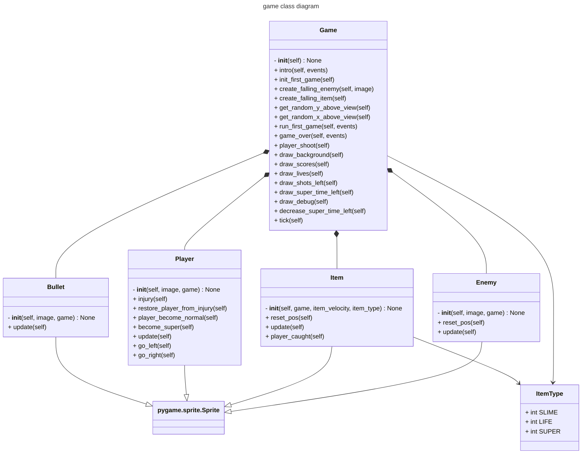

# 👾 Wilmut Invader 👾


<center>🚀 Tap <a href="https://engdan77.github.io/wilmut_invader/">HERE</a> to play the browser version ▶️ </center>


## The plot of the game

Wilmut living a pieceful life on the mountain referred as "bärget" close to Huskvarna ⛰️.. until the family becomes cursed and she has to use her slime to protect herself 🦠 as the family members multiplies and becomes faster she has to fight 💪🏻 ... 

## How to play

⬅️     Left key to move left.. or click the left part of touch touchscreen (e.g. iPhone/Android/tablets)

➡️     Right key to move right .. or click the right part of the touchscreen

☄️     Shoot using the spacebar key .. or the middle of the touchscreen

## Items in game

🟩    Can of slime - gives you an additional 30 slime balls as ammunition

❤️    Heart - gives you additional life

🟨    Super - will grant powers to throw giant 💩

## How can this game be run?

- Handheld [Miyoo](https://miyooofficial.com/) devices (á la GameBoy) running [OnionOS](https://onionui.github.io/)
- Within modern web-browsers supporting [WebAssembly](https://webassembly.org/features/)
- As pure native [PyGame, it is](https://www.pygame.org/) easily installable using [UV](https://astral.sh/blog/uv) as a package manager

## Videos

....

## Background and reflections

As the daughter turns 10 years old and loves to play games - I saw this cool, affordable handheld console [Miyoo Mini V4, which](https://shorturl.at/wHftG) allows you to run old retro games from Nintendo, etc. But thought it would be even cooler to develop a game from scratch and discovered that a ported version of Python 2.7 existed and thought it would be a good opportunity to put the [PyGame](https://www.pygame.org/) library to test 🤓...

It turned out to be quite easy using [Python](https://www.python.org/) as the programming language, so in 10% of the time put into this, I got 90% of everything there .. as with always the remaining 90% of the time those last 10% polishing was put 🤭

What had to be made that probably stands out was to cleverly design the source to be compatible with PyGame 1.x running in Python 2.7 as well as PyGame 2.x in more recent Python 3.12 including [async/await](async/await) so that it would allow me to use [PygBag](https://pygame-web.github.io/wiki/pygbag/) to compile this game into [WebAssembly](https://en.wikipedia.org/wiki/WebAssembly) that we I could run this game within any modern web browser. This is awesome .. we can now basically run this game on any device including an iPhone if you want to.

Also using [Github Actions](https://github.com/engdan77/wilmut_invader/actions) as [CI/CD](CI/CD) so that on every push it would automatically compile this into a runnable game accessible from https://engdan77.github.io/wilmut_invader/

I also developed a script [build_onionos_port.py](src/wilmut_invader/build_onionos_port.py) that would easily allow me to export this game into an <u>SD card</u> you could put into the Miyoo handheld.

## Installation

For the below instructions, the project/package manager UV can be installed by following [these](https://docs.astral.sh/uv/getting-started/installation/) instructions.


### Port to Miiyo/OnionOS Game Console

Insert the microSD card containing the *roms* and from the project use the developed 
helper command uses the target directory it is being mounted at to have it port the game to this card,
eject and then re-insert into your console.

```shell
uv run src/wilmut_invader/build_onionos_port.py /Volumes/USB/
```

## Run the game

### From web

Just go to https://engdan77.github.io/wilmut_invader/

#### From the source

```shell
uvx --from git+https://github.com/engdan77/wilmut_invader.git wilmut-invader
```

## Software architecture



