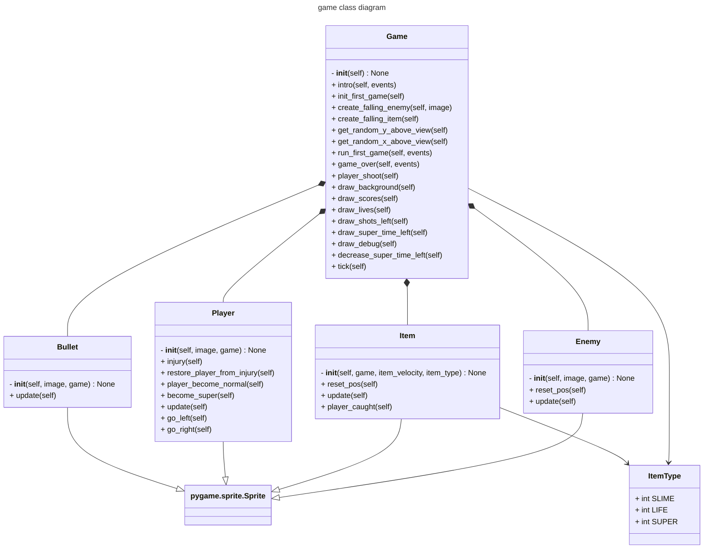

# 👾 Wilmut Invader

_Work in progress_

In the meantime try this out at:
https://engdan77.github.io/wilmut_invader/

## Installation

For the below instructions the project/package manager UV you can install 
by following [these](https://docs.astral.sh/uv/getting-started/installation/) instructions.


### Port to Miiyo/OnionOS Game Console

Insert the microSD card containing the roms and from the project use the developed 
helper command use the target directory it being mounted at to have it port the game to this card,
eject and then re-insert into your console.

```shell
uv run src/wilmut_invader/build_onionos_port.py /Volumes/USB/
```

## Run the game

#### From the source

```shell
uvx --from git+https://github.com/engdan77/wilmut_invader.git wilmut-invader
```

## Software architecture

Class relationship



